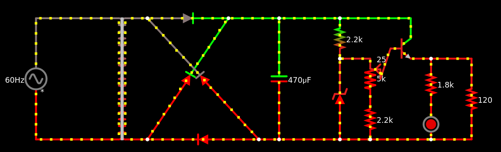
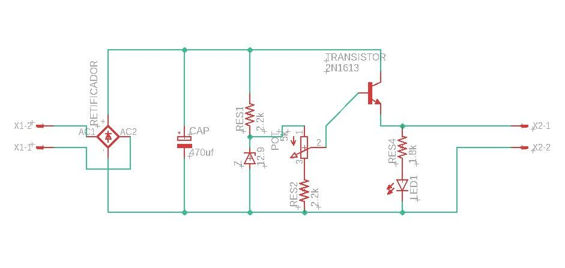
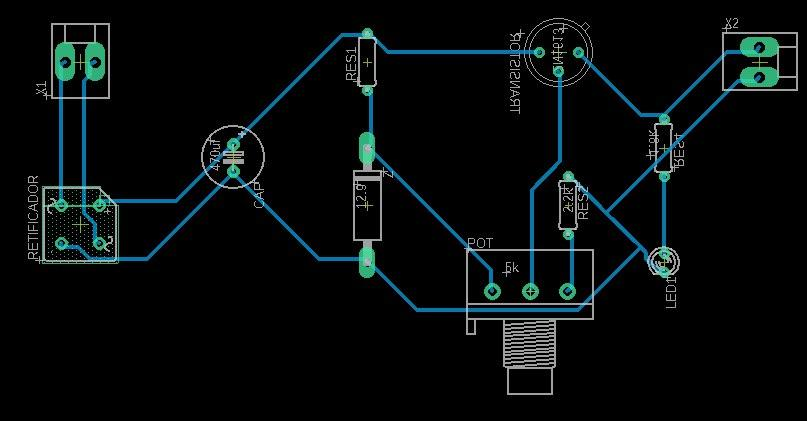

# Fonte de Tensão Variável (12V-3V)
## Introdução
Projeto para a aula de Eletrônica para Computação (SSC0180), no ICMC/USP-São Carlos, ministrada pelo docente [Eduardo Simões](https://gitlab.com/simoesusp).
O projeto consiste numa fonte de alimentação de tensão variável, feita num simulador com o uso de resistores, diodos, capacitores, transformadores e um regulador de tensão.

O circuito fora feito pelo grupo 9 de 2020/1:  
- [Natan Sanches](https://github.com/natan-dot-com);  
- [Gabriel Vicente Rodrigues](https://github.com/gabriel-vr);  
- [Lucas Mihara](https://github.com/lucasmihara);  
- [Vitor Beneti Martins](https://github.com/benetche).  

Projeto indexado ao [Gitlab](https://gitlab.com/simoesusp/disciplinas/-/tree/master/SSC0180-Eletronica-para-Computacao).

## Sobre o projeto
O projeto, por medidas de restrição social, fora feito em dois simuladores de circuitos elétricos: no [Falstad](http://tinyurl.com/y9k5xbtm), online, e no Eagle, outro simulador mais completo que também executa a impressão da placa de circuito final. As imagens e o arquivo do projeto estão contidos neste repositório e a seguir. 
Houve também a produção de um [vídeo explicativo](https://youtu.be/nBSvIfqxYiY) acerca do projeto, que complementará a leitura dos circuitos.
### Esquemático - Falstad:

### Esquemático - Eagle:
 
### Placa de circuito - Eagle:
 

Lista de materiais utilizados:
- 1x Capacitor Eletrolítico 470µF/50V - R$ 0,90
- 1x Diodo Zener 13V/0,5W - R$ 0,09
- 4x Diodo 1N4007 - R$ 0,44 (Substituível por uma ponte retificadora)
- 1x Transistor NPN BC337 - R$ 0,18
- 1x Resistor 1K8 - R$ 0,08
- 2x Resistor 2K2 - R$ 0,16
- 1x Potenciômetro Linear de 5K - R$ 1,09
- 1x LED Difuso Branco - R$ 0,23

CUSTO TOTAL: R$ 3,17
